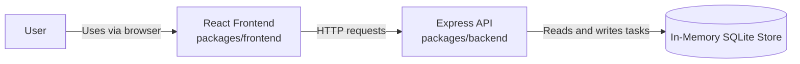
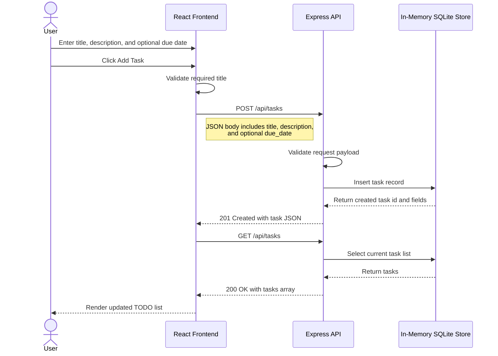

# Cloud Architecture Overview

This document provides a simple system context view of the monorepo and a request flow for creating a TODO item. The architecture is intentionally minimal and avoids cloud-provider-specific components.

## System Context

## Sequence: User Creating a TODO

